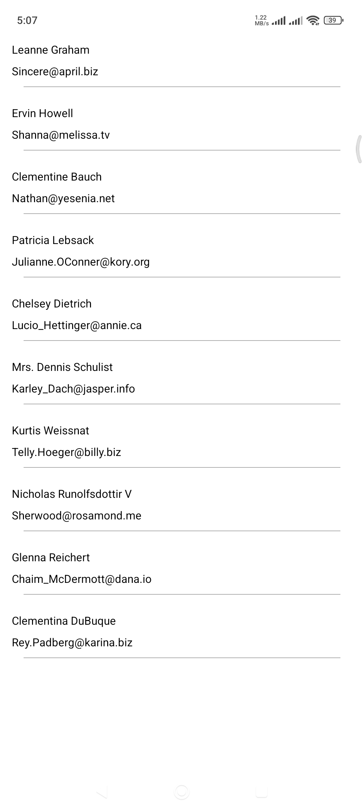

# LearningAndroid
This is a sample project to practice and improve my hard skills in Kotlin and Android development.  
The app fetches and displays a list of users from a free public API.

## Features
- Fetches data from a free API.
- Displays a list of users in a RecyclerView.
- Implements modern Android development practices.

## Technologies Used
- **Programming Language**: Kotlin
- **API Client**: Retrofit
- **Architecture**: MVVM
- **Other Libraries**:
    - Hilt
    - Coroutines for background tasks

## API Information
This app uses the (https://jsonplaceholder.typicode.com/) to fetch user data.

## Screenshots
